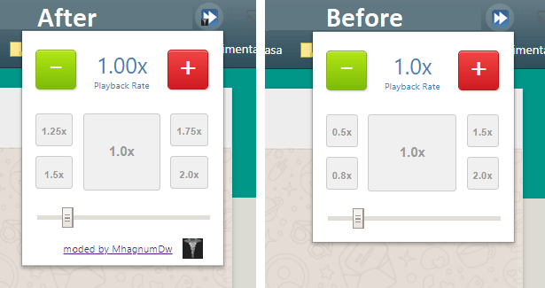

# Playback-Rate-Controller

A Google Chrome Extension for controlling HTML5 audio/video playback rate.

## Que mudanças esse fork fez?

- Removeu as velocidades 0.5x e 0.8x
- Adicionou as velocidade 1.25x e 1.75x
- _Playback Rate_ passa a exibir duas casas decimais ao invés de uma
- Adicionou características que indicam que a extensão é modificada



## Instalando

Como essa extensão não é publicada na Chrome Web Store, um conjunto de passos descritos abaixo sào necessários.

## Opção 1 (extensão desempacotada, mais simples)

- Download do fonte da extensão [clicando aqui](https://github.com/mhagnumdw/Playback-Rate-Controller/archive/master.zip)
- Extrair
- No Chrome: menu Opotions > Extensions ou [clicando aqui](chrome://extensions/)
- Ativar a opoção `Developer Mode`
- Na opção `Load unpacked` apontar para a pasta onde a extensão foi extraída
- Agora a exntensão está ativa

## Opção 2 (extensão empacotada no formato crx, mais complexo)

- Download do arquivo `.crx` da extensão [clicando aqui](https://github.com/mhagnumdw/Playback-Rate-Controller/releases/download/1.3.1.1/Playback-Rate-Controller.crx)
- No Chrome: menu Opotions > Extensions ou [clicando aqui](chrome://extensions/)
- Arrastar o arquivo da exntensão para cima do Chrome
- No popup que aparece Clicar em `Add Extension`
- Extensão adicionada, mas por segurança o Chrome não a ativa
- Copie o ID da extensão

Agora começa a etapa que varia conforme o Sistema Operacional.
É preciso colocar a extensão em uma whitelist para que o Chrome permita sua execução.

### Windows

- No registro criar a chave `HKEY_CURRENT_USER\Software\Policies\Google\Chrome\ExtensionInstallWhitelist` (se um item não existir, botão direito sobre um item > Novo > Chave)
- Dentro de `ExtensionInstallWhitelist` > botão direito > Novo > Valor da Cadeia de Caracteres
- Nomeie como `1`, se ja existir então `2`, e assim por diante
- Dois cliques sobre o registro criado e no valor colocar o ID da extensão
- Acesse a políticas do Chrome [aqui](chrome://policy/) e clique em `Reload polices`

### Linux

// TODO: não testado

- Dentro da pasta `/etc/opt/chrome/policies/managed`
- Crie ou atualize o arquivo `policies.json` com o conteúdo

    ```json
    {
        "ExtensionInstallWhitelist": [
            "ID-DA-EXTENSAO-AQUI"
        ]
    }
    ```

> **NOTA:** se já existirem políticas, apenas atualize.

- Acesse a políticas do Chrome [aqui](chrome://policy/) e clique em `Reload polices`

### Mac OS

- // TODO: documentar
- Acesse a políticas do Chrome [aqui](chrome://policy/) e clique em `Reload polices`

### Checando se deu tudo certo

- Se a extensão estiver ativa tudo ok!

> **NOTA:** se a página web já estiver aberta pode ser necessário um reload.

### Referências

- [Chrome ​Extension​Install​Whitelist Policy](https://cloud.google.com/docs/chrome-enterprise/policies/?policy=ExtensionInstallWhitelist)
- [Chromium ​Extension​Install​Whitelist Policy](https://www.chromium.org/administrators/policy-list-3#ExtensionInstallWhitelist)

## Original version

### Chrome Webstore

<https://chrome.google.com/webstore/detail/playback-rate-controller/hoaomahcgkefmbbphgnedkllmaincgae>

### GitHub

<https://github.com/smatric/Playback-Rate-Controller>
